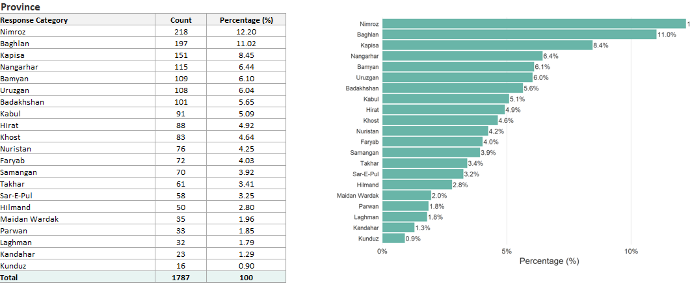
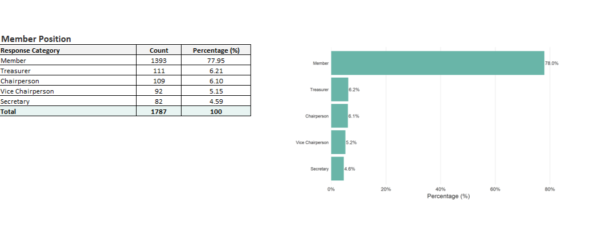
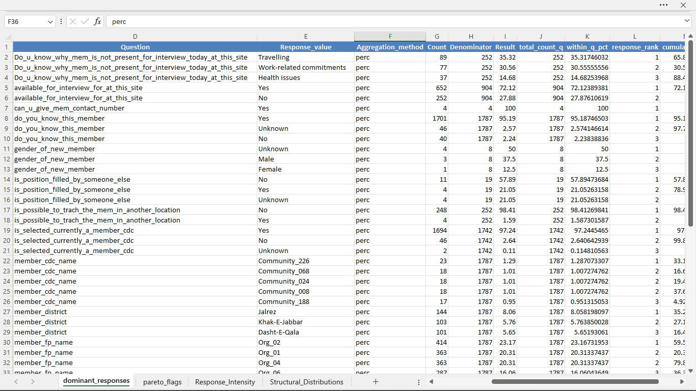
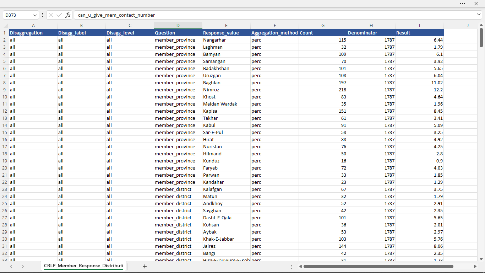
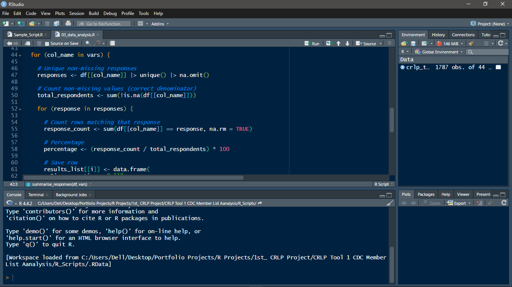
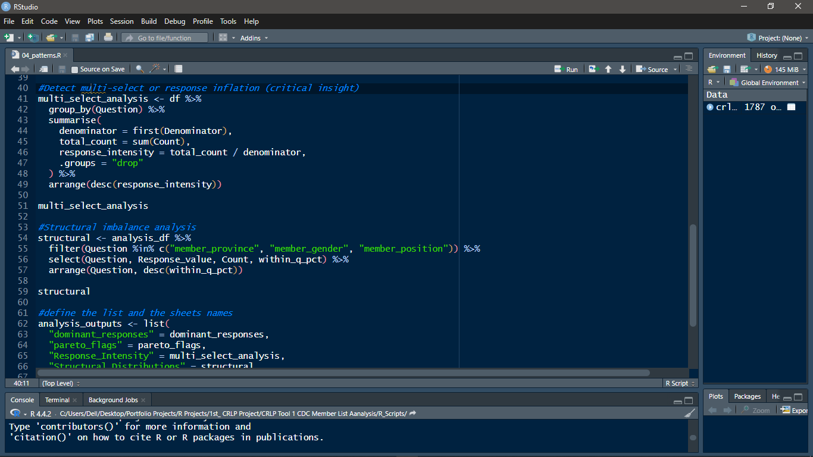
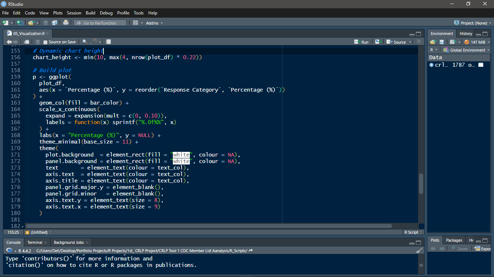

# CRLP Tool 1 – CDC Member Data Analysis

## Overview
This repository contains a complete data audit, cleaning, descriptive analysis, and reporting workflow for **Community Development Council (CDC) member verification data** collected under **UNOPS’ Afghanistan Community Resilience and Livelihoods Project (CRLP)** using Tool 1.

The analysis supports program monitoring, fiduciary oversight, and evidence-based reporting by assessing data quality, response distributions, and operational patterns.

---

## Objectives
- Assess completeness, consistency, and reliability of CDC member data
- Verify CDC member recognition, availability, and current membership status
- Analyze gender balance, role composition, and geographic coverage
- Identify operational constraints related to availability, tracing, and replacement
- Produce standardized tables and visualizations suitable for donor reporting

---

## Dataset Summary
- **Total Interviews:** 1,787 CDC members  
- **CDCs Covered:** 236  
- **Provinces:** 21  
- **Gender Distribution:**  
  - Male: 54%  
  - Female: 46%  

> ⚠️ Note: Any shared datasets are anonymized or structured samples. Original data is confidential.

---

## Methodology
1. **Data Audit**
   - Missing values assessment
   - Duplicate detection
   - Structural and consistency checks

2. **Data Cleaning**
   - Standardized variable names
   - Harmonized categorical responses
   - Validation of CDC identifiers and contact fields

3. **Descriptive Analysis**
   - Frequency and percentage distributions
   - Question-specific denominators
   - Identification of dominant and atypical response patterns

4. **Visualization**
   - Standardized horizontal bar charts
   - Publication-ready tables aligned with reporting needs

All steps were implemented using **reproducible R workflows**.

---

## Repository Structure
data/ → Raw and cleaned datasets
scripts/ → R scripts for audit, cleaning, and analysis
outputs/ → Analytical tables and plots
report/ → Final analytical report (PDF)
screenshots/ → Key figures and tables for quick review

---

## Key Outputs
- Clean analytical dataset with standardized variables
- Descriptive tables with correct denominators
- Clear visualizations of response distributions
- Comprehensive analytical report in PDF format

---
## Sample Visual Outputs

### Geographic Distribution

### CDC Member Position

### Dominant Responses

### Member Response Distribution

---

## Reproducible R Workflow

The analysis was implemented using a structured and reproducible R workflow.  
Scripts are organized by analytical stage (audit, cleaning, analysis, visualization).

---
## Tools & Technologies
- R
- dplyr
- tidyr
- janitor
- ggplot2

---

## Use Case
This analysis supports:
- Program monitoring and verification
- Fiduciary oversight and accountability
- Donor reporting
- Operational decision-making

---

## Author
**Farhad Sahebi**  
Data Analyst | Monitoring & Evaluation | Data Quality & Verification

